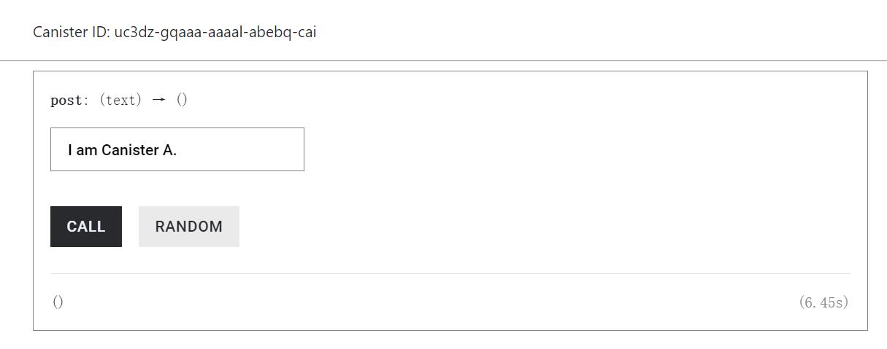
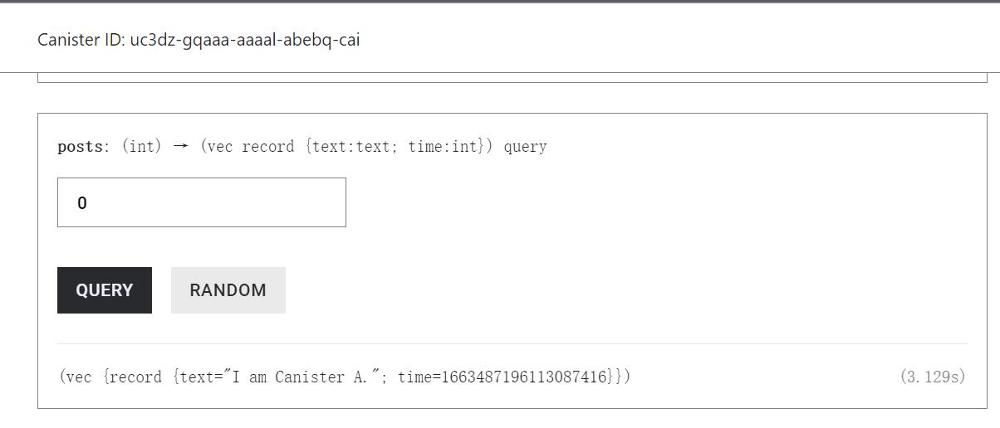
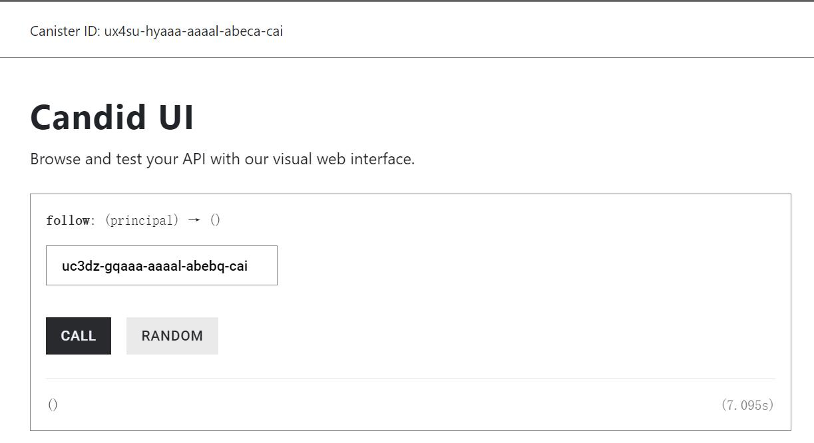
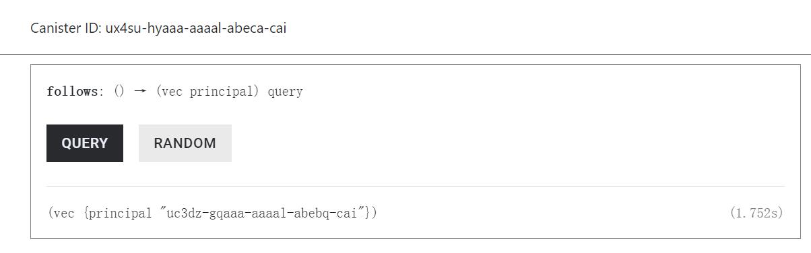
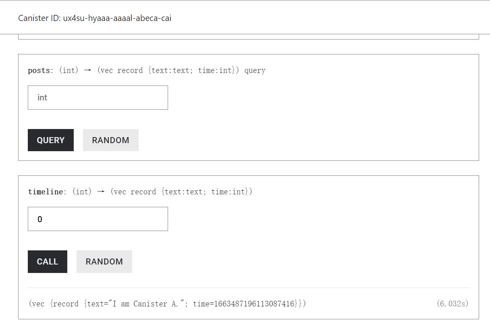

# Course 4 Microblog

第四课作业

## Motoko代码

```typescript
/* main.mo */
import Iter "mo:base/Iter";
import List "mo:base/List";
import Principal "mo:base/Principal";
import Time "mo:base/Time";

actor {
  type Time = Time.Time; // 定义Time类型

  public type Message = { // 定义Message的Record类型，包含text和time两个变量
    text: Text;
    time: Time;
  };

  public type Microblog = actor {
    follow: shared(Principal) -> async (); // 添加关注对象
    follows: shared query () -> async [Principal]; // 返回关注列表
    post: shared (Text) -> async (); // 发布新消息
    posts: shared query (Time) -> async [Message]; // 返回所有发布的消息
    timeline: shared (Time) -> async [Message]; // 返回所有关注对象发布的消息
  };

  stable var followed: List.List<Principal> = List.nil();

  public shared func follow(id: Principal): async () {
    followed := List.push(id, followed);
  };

  public shared query func follows(): async [Principal] {
    List.toArray(followed);
  };

  stable var messages: List.List<Message> = List.nil();

  public shared (msg) func post(text: Text): async () {
    assert(Principal.toText(msg.caller) == "oeo2i-5hw57-hh6wd-2v376-t4cy6-j6ihw-kc7j5-eksox-t34te-j4p2a-zae");
    var sendmsg: Message = {
      text = text;
      time = Time.now();
    };
    messages := List.push(sendmsg, messages);
  };

  // 返回满足Time>since的元素
  public shared query func posts(since: Time): async [Message] {
    var res: List.List<Message> = List.nil();
    for (msg in Iter.fromList(messages)) {
      if (msg.time >= since) {
        res := List.push(msg, res);
      };
    };
    List.toArray(res);
  };

  // 返回关注列表中Time>since的元素
  public shared func timeline(since: Time): async [Message] {
    var all: List.List<Message> = List.nil();
    for (id in Iter.fromList(followed)) {
      let canister: Microblog = actor(Principal.toText(id));
      let msgs: [Message] = await canister.posts(since);
      for (msg in Iter.fromArray(msgs)) {
        all := List.push(msg, all);
      };
    };
    List.toArray(all);
  };

  // public shared func clearFollow(): async [Principal] {
  //   for (follow in Iter.range(0, (List.size<Principal>(followed)))) {
  //     if (List.isNil<Principal>(followed)) {
  //       var followed: List.List<Principal> = List.pop<Principal>(follow);
  //     };
  //   };
  //   List.toArray(followed);
  // };

  // public shared func clearPost(): async [Message] {
  //   for (post in Iter.range(0, (List.size<Message>(messages)))) {
  //     if (List.isNil<Message>(messages)) {
  //       var messages: List.List<Message> = List.pop<Message>(post);
  //     }  
  //   };
  //   List.toArray(messages);
  // };
}
```

## 样例演示

其中microblog_backend的Canister ID：uc3dz-gqaaa-aaaal-abebq-cai，

microblog_backend2的Canister ID：ux4su-hyaaa-aaaal-abeca-cai

以下使用A代表microblog_backend，使用B代表microblog_backend2。

首先在A中使用post函数发布一个消息



随后调用A的posts函数查看已发布的所有消息



使用B的follow函数关注A



使用B的follows函数列出所有关注的对象



使用B的timeline函数列出关注对象发的信息



## 思考题

Q：如果关注对象很多，运行 timeline 就会比较慢，有什么办法可以提高效率？

A：Canister自身会有一定的存储空间，可以考虑使用空间换时间，牺牲存储空间来存储关注对象的消息数据，这样可以提高调用timeline的效率。然而这样对Canister的存储空间的消耗也较大，开发者需要在调用速度和内存大小中权衡。

